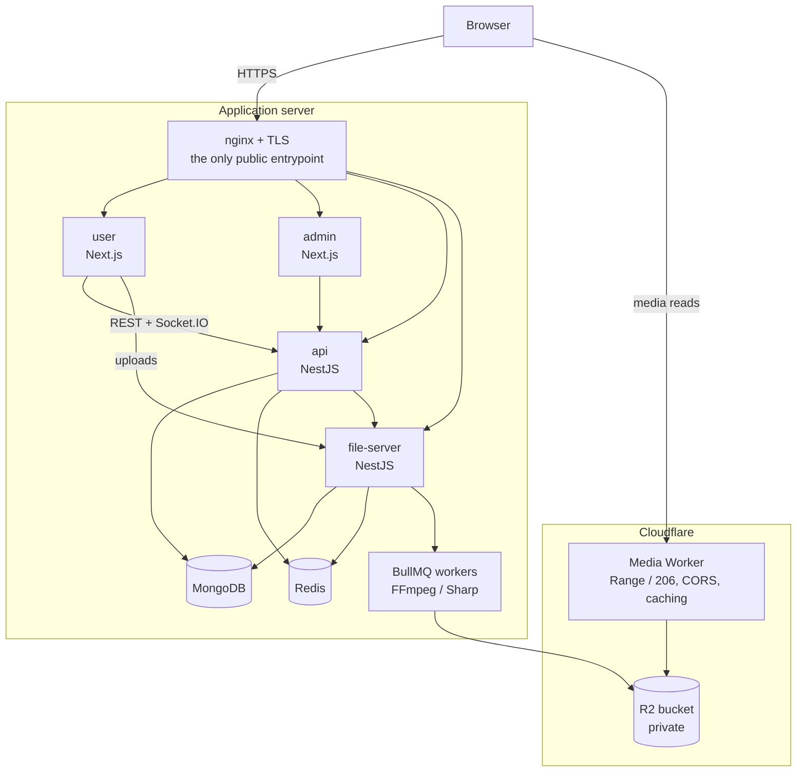

# Short Video Platform

A production-deployed, full-stack short-video and photo social platform: creator publishing,
a ranked discovery feed and a personalized recommendation feed, real-time social interactions,
private messaging, and an asynchronous media pipeline that transcodes and serves video from
object storage.

Built as an independent engineering project — not affiliated with, and not a reproduction of,
any commercial platform.

**[▶ Live Demo](https://app.136.85.26.121.sslip.io)** &nbsp;·&nbsp;
[Architecture](#production-architecture) &nbsp;·&nbsp;
[Recommendation System](#recommendation-system) &nbsp;·&nbsp;
[Media Pipeline](#media-pipeline) &nbsp;·&nbsp;
[Documentation](docs/index.md) &nbsp;·&nbsp;
[Deployment Runbook](docs/deployment/routine-deploys.md)

> The demo runs on a small cloud VM behind Let's Encrypt TLS, using a hostname derived from the
> server's IP. Browse as a guest, or register an account to like, comment, follow and message.

---

## Overview

The platform is four independently deployed applications, each with its own dependencies,
environment and verification commands:

| Application | Responsibility | Stack | Guide |
| --- | --- | --- | --- |
| `user` | Public web app — feeds, post detail, profiles, messaging | Next.js (App Router), React, Tailwind | [user/README.md](user/README.md) |
| `admin` | Administration — users, categories, settings, logs | Next.js, Ant Design | [admin/README.md](admin/README.md) |
| `api` | Auth, content, social graph, messaging, notifications, recommendations | NestJS, MongoDB, Redis, BullMQ | [api/README.md](api/README.md) |
| `file-server` | Uploads and asynchronous media processing | NestJS, FFmpeg, Sharp, TUS, S3/R2 | [file-server/README.md](file-server/README.md) |

Splitting media processing out of the API is deliberate: transcoding is CPU- and memory-bound and
must not compete with request handling. Everything shared between apps that must not drift — upload
policy, toast behaviour — lives in versioned packages under `shared/`.

---

## Highlights

**Content and creators**
- Publish video **and** multi-image posts, with cover selection, categories, hashtags and mentions
- Creator workspace: manage, pin, batch-select and delete published posts
- Public creator profiles with works, liked posts, follower/following lists and pinned ordering

**Discovery**
- **Home** — a broad discovery feed mixing trending, fresh, category-diverse and personalized sources
- **For You** — a personalized feed weighted toward the viewer's own affinities and watch behaviour
- Browsing chains that keep scrolling past a single ranked session without repeating a post
- Search across posts, creators and hashtags, with suggestions, history and trending topics

**Social and real-time**
- Comments, threaded replies, likes, follows and @mentions
- Notifications with grouping, category filters and live delivery over Socket.IO
- Shared post counters reconciled from server snapshots, so every mounted copy of a post agrees
- Presence/online status backed by Redis

**Messaging**
- Private one-to-one conversations with follow-based send permission and request-based consent
- Block and restrict, enforced server-side
- Sharing a post into a conversation as a real message

**Platform**
- Email verification, password reset and a shared login/signup dialog that preserves the page
- Admin category management, system settings, and audit/request/exception/system log viewers
- Versioned MongoDB migrations and a reproducible demo dataset with provenance tracking

**Infrastructure**
- Docker Compose deployment behind nginx with Let's Encrypt TLS
- Cloudflare R2 for media, served through a Worker that honours HTTP `Range` so video seeks
- BullMQ workers for transcoding, cleanup and scheduled jobs, safe to run on multiple instances
- Automated test suites for the API and the user app, plus a test suite for the media Worker

---

## Production Architecture



Two properties are worth calling out:

- **Media reads never touch the application server.** Playback and image loading go browser →
  Worker → R2, which is what keeps a small VM viable for a video site. Uploads and processing *do*
  run on the VM, so that claim is deliberately narrow.
- **Only nginx is public.** Every container binds to loopback; MongoDB and Redis publish no host
  port at all.

Detailed topology, environment matrix and cost analysis: [docs/deployment/README.md](docs/deployment/README.md).

---

## Recommendation System

A heuristic, explainable recommender built from publicly documented signal categories. It is **not**
a reproduction of any platform's proprietary ranking system.

**Two surfaces, deliberately different.**

|  | Home | For You |
| --- | --- | --- |
| Purpose | Broad discovery and browsing | Personalized to the viewer |
| Candidate mix | Weighted toward trending, fresh and category-diverse sources | Weighted toward the viewer's affinities |
| Scoring | Balanced across interest, engagement quality and freshness | Weighted toward user interest and watch quality |
| Session size | Larger, grid browsing | Shorter, one post at a time |
| Category scope | Scoped by the selected category tab | Whole catalogue |

**Cold start.** A signed-out visitor gets a guest mix — recent-popular, fresh and category-diverse —
and never a fabricated preference profile. Guests are identified by an opaque, app-issued session id
so their browse stays coherent across page loads; it is never a device fingerprint.

**Signals.** Impressions, watch completion, quick skips, replays, photo dwell time, detail opens,
likes, comments, shares and follow-after-view are ingested as batched events, deduplicated per
exposure, and validated server-side rather than trusted from the client. They feed a per-subject
affinity profile over categories, hashtags and creators, with time decay so recent interest
outweighs old.

**Ranking.** Candidates are retrieved per source under a quota, scored on bounded features
(interest, watch quality, engagement quality, freshness, exploration bonus, creator affinity),
then re-ranked for diversity — caps on posts per creator and per category within a window, and no
two consecutive posts from the same creator. Selection is a seeded weighted draw rather than a
top-N slice, so two visits produce genuinely different sessions instead of the same list re-sorted.

**Sessions and chains.** One ranked order is generated once, stored in Redis, and paged by an
opaque cursor — so scrolling can never duplicate or skip. A session is deliberately a *sample* of
the candidate pool, not the whole catalogue. When one is spent, the browse rolls over into a
successor session in the same **browsing chain**, ranked over what that chain has not served yet.
Every eligible post appears at most once per browse; when the chain has shown them all it says so
and stops. Reloading, switching category or asking for a refresh starts a new chain.

Implementation notes: [docs/features/feeds-and-recommendations.md](docs/features/feeds-and-recommendations.md).

---

## Media Pipeline

```
upload (TUS, resumable)
  -> ownership + durable upload-type policy checked server-side
  -> format validated from the bytes, not the filename or declared MIME
  -> video: FFmpeg probe + transcode + thumbnails   image: Sharp re-encode + blur placeholder
  -> uploaded to Cloudflare R2
  -> attached to the owning record only after it is written
  -> served through the Worker, which honours Range so video seeks
```

Points that shaped the design:

- **Uploads are validated from their bytes.** Extension, declared MIME and the `accept` attribute
  are all chosen by whoever uploads; renaming a video to `.png` changes all three at once.
- **Each upload type names its own limits** in a shared package read by the API, the file server and
  the web client, so client-side feedback and server-side enforcement cannot drift. A type with no
  policy is refused rather than defaulting to permissive.
- **Video and image validation are separate.** An audio file renamed `.mp4` is a valid MP4; only
  probing the video streams catches it.
- **Expensive validation is bounded** by a concurrency gate with child-process timeouts, because
  resumable uploads complete whenever transfers happen to finish.
- **Storage dispatches per file, not per config.** Every record stores its own storage type, so
  switching the driver never re-points existing media or sends deletes to the wrong backend.
- Heavy work runs on BullMQ workers; a swept cleanup job reclaims files that were uploaded but never
  attached.

Details: [docs/features/file-uploads-and-processing.md](docs/features/file-uploads-and-processing.md).

---

## Real-time and Social Behaviour

- **Socket.IO with a Redis adapter**, so events fan out correctly across multiple API instances.
- **Counters reconcile to the server.** Shared totals (likes, comments, shares) arrive as absolute
  snapshots rather than deltas, so a client that missed a frame is corrected by the next one instead
  of drifting. Viewer-specific state such as "did *I* like this" is never taken from a shared
  snapshot.
- **One post, many copies.** The same post can be mounted in a feed, a modal, a creator grid and a
  search result at once; interaction changes fan out by post id so every copy agrees immediately.
- **Notifications** are grouped, filterable by category, and delivered live with unread state.
- **Messaging permission is enforced in the service layer**, not just hidden in the UI: follow-based
  send rights, request-based consent, and block/restrict.

---

## Testing and Quality

- **API** — Jest unit and service-level suites across controllers, services, payloads, DTOs and
  migrations, with MongoDB, Redis and queues mocked at the unit boundary.
- **User app** — Jest with React Testing Library, covering hooks, feed and modal navigation,
  recommendation session behaviour, and regression suites written from real production defects.
- **Media Worker** — its own suite, runnable with no network.
- **Production verification** — health endpoints, loopback and public HTTPS smoke checks, and a
  read-only media range check, documented per deploy.

Per-application commands:

| Application | Commands |
| --- | --- |
| `api` | `yarn test`, then `yarn build` (no lint script) |
| `user` | `yarn test`, `yarn lint`, then `yarn build` |
| `file-server` | `yarn lint`, then `yarn build` (no test suite) |
| `admin` | `yarn lint`, then `yarn build` (test runner not configured yet) |

---

## Local Development

Requires Node.js 22+, Yarn 1.x, Docker (for MongoDB and Redis) and FFmpeg on your `PATH`.

```bash
git clone https://github.com/shenzhoul/short-video-platform.git
cd short-video-platform

# 1. Install per application
for app in api file-server user admin; do (cd "$app" && yarn install); done

# 2. Copy the environment templates and fill in local values.
#    Every secret in these files is empty or a placeholder — no real credential
#    is ever committed, and none is needed to run locally.
for app in api file-server user admin; do cp "$app/.env.example" "$app/.env"; done

# 3. Start MongoDB and Redis (any local instance works; the defaults expect
#    mongodb://localhost and redis://localhost:6379)
docker run -d --name svp-mongo -p 27017:27017 mongo:8.0
docker run -d --name svp-redis -p 6379:6379 redis:7.4-alpine

# 4. Apply database migrations — these seed system settings and create the
#    initial administrator account, so the admin app cannot be signed into
#    before this runs. Change that account's password before exposing the
#    environment to anyone.
(cd api && yarn migrate)

# 5. Run the services (each in its own terminal)
(cd api && yarn dev)          # http://localhost:8080
(cd file-server && yarn dev)  # http://localhost:8000
(cd user && yarn dev)         # http://localhost:8081
(cd admin && yarn dev)        # http://localhost:8082
```

Optional: `cd api && yarn demo:fetch-media && yarn demo:seed` builds a reproducible demo dataset
from licensed stock media, with provenance tracking and an idempotent ledger. See
[docs/features/demo-dataset.md](docs/features/demo-dataset.md).

Browser traffic reaches the API through a Next.js rewrite rather than a direct call, while uploads
go straight to the file server — see [user/src/PROXY_SETUP.md](user/src/PROXY_SETUP.md).

---

## Production Deployment

All four applications run as Docker containers on a single cloud VM, behind host nginx with
Let's Encrypt TLS. MongoDB and Redis are private services on the same host with no published port.
Media lives in a private Cloudflare R2 bucket, read through a Worker with an R2 binding — no S3
credential ever reaches the edge or a browser.

Deploys are per-service: rebuild only the image whose source changed, recreate only that container,
and verify. Nothing in a normal deploy stops the database, removes a volume or resets data.

- **[Routine deploys](docs/deployment/routine-deploys.md)** — which image each source area
  invalidates, per-service commands, verification, rollback, and a cheat sheet
- **[First-time setup](docs/deployment/README.md)** — architecture, environment matrix, TLS, the
  Worker, cost and backup

> Vercel is **not** the deployment path. An earlier attempt to host the two Next.js apps there was
> abandoned after its build step could not ingest the function-symlink layout Next 16 emits; both
> apps became containers on the same VM as the backend. The history is kept in the deployment docs
> because the constraint that caused it is still worth knowing.

---

## Documentation

| Area | Document |
| --- | --- |
| Index of everything | [docs/index.md](docs/index.md) |
| System architecture | [docs/architecture.md](docs/architecture.md) |
| Verified highlights | [docs/highlights.md](docs/highlights.md) |
| Feature guides | [docs/features/](docs/features/README.md) |
| Domain models | [docs/domains/](docs/domains/README.md) |
| Deployment | [docs/deployment/](docs/deployment/README.md) |
| Security posture | [docs/security.md](docs/security.md) |
| Roles and permissions | [docs/user-roles.md](docs/user-roles.md) |

---

## Screenshots

| | |
| --- | --- |
| **Home and content discovery**<br/>Ranked feed with category navigation and hover previews |  |
| **Post detail**<br/>Playback, comments, replies, reactions and creator surfaces |  |
| **Creator publishing**<br/>Post information, cover selection, settings and live preview |  |
| **Creator content management**<br/>Published content, status, engagement metrics and batch actions |  |
| **Profile and notifications**<br/>Creator profile with real-time social notifications |  |
| **Search and discovery**<br/>History, suggestions, trending topics, hashtags and results |  |
| **Direct messaging**<br/>Follow-aware consent, live unread state and a right-side workspace |  |

---

## Status

**Production-deployed and actively maintained.** The full stack — user app, admin app, API, file
server, MongoDB, Redis, and R2-backed media — runs in production behind TLS, with a seeded demo
catalogue and a documented deploy and rollback procedure.

Work continues on recommendation quality, test coverage and UI refinement.

---

## Author

Built as an independent full-stack engineering project, with a focus on frontend architecture,
real-time systems, recommendation infrastructure and media-heavy web applications.

[GitHub](https://github.com/shenzhoul) · [Live Demo](https://app.136.85.26.121.sslip.io)
