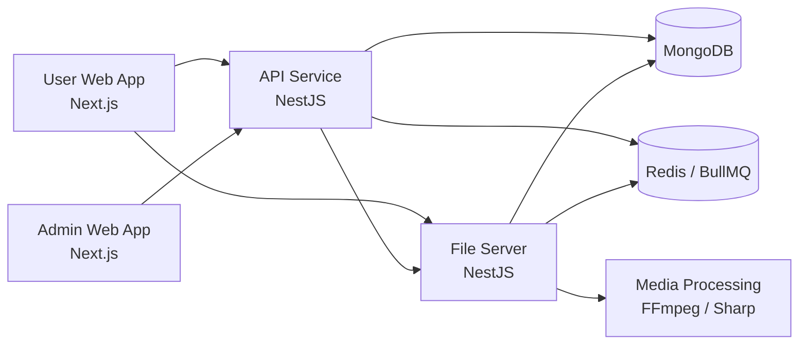
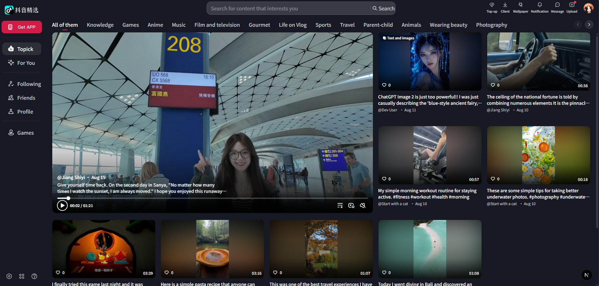
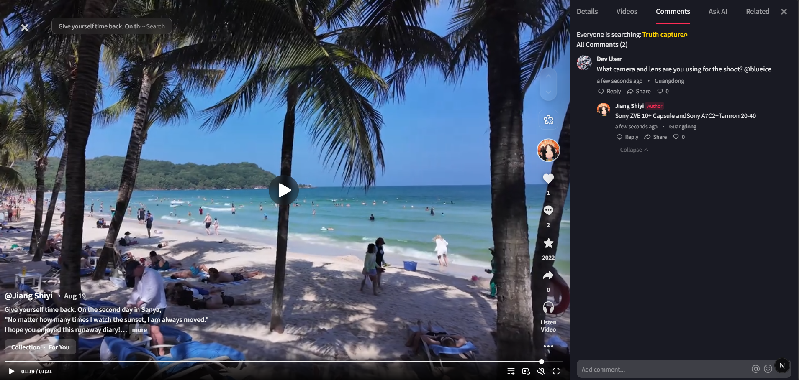
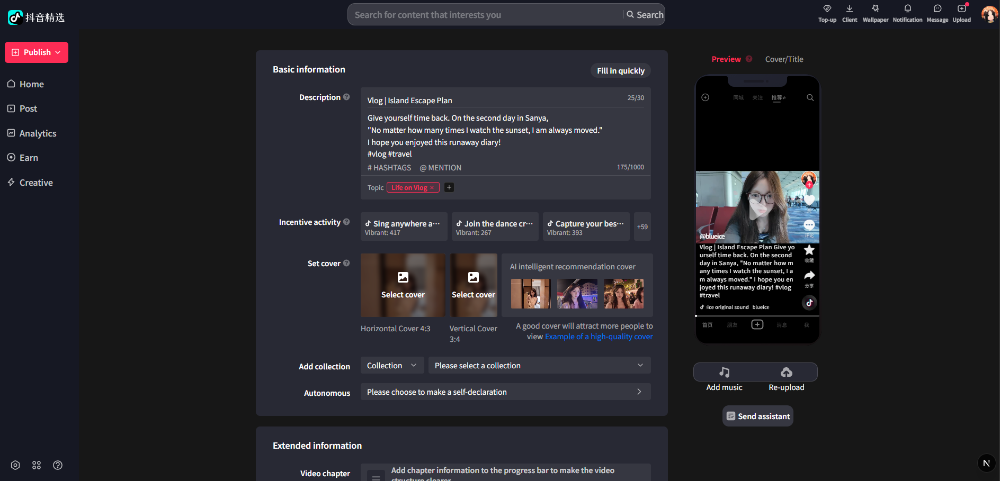
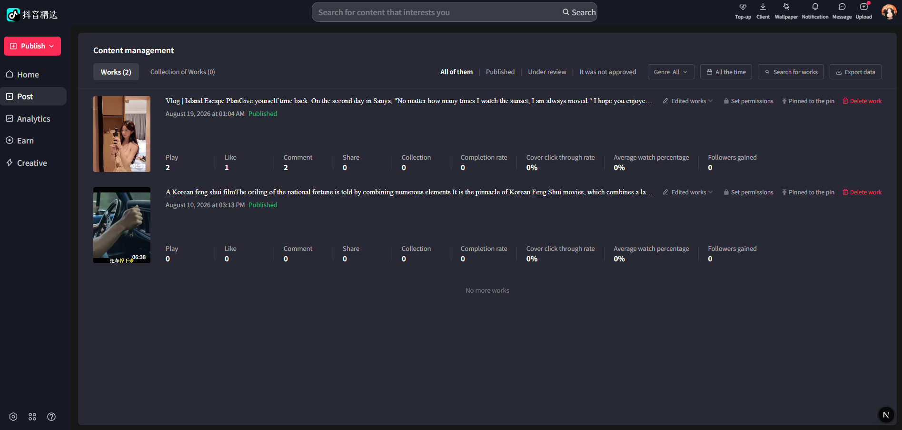
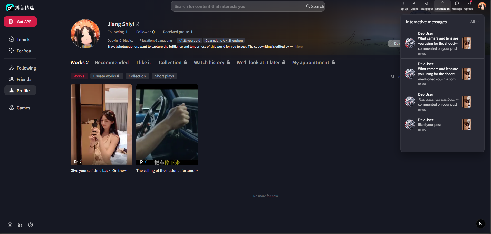
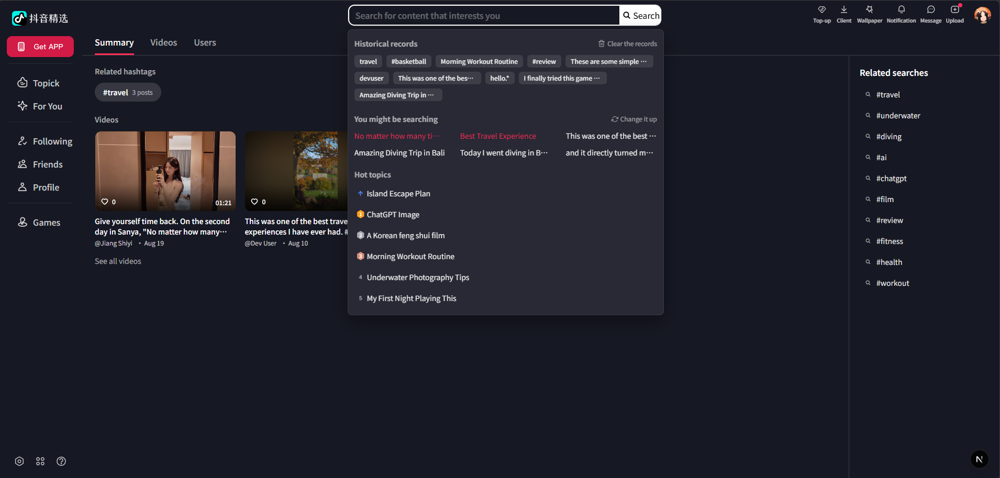
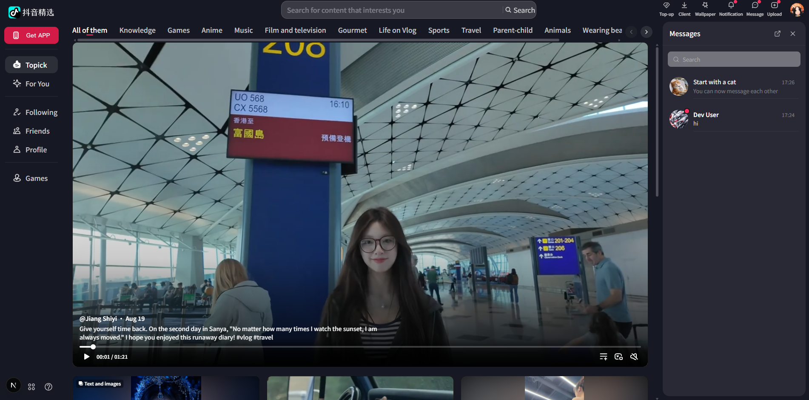

# Short Video Platform

A full-stack social platform inspired by Douyin, focused on short-form video and photo content, creator workflows, real-time interactions, private messaging, and media processing.

This project is being developed as a personal engineering project with a strong focus on frontend architecture, real-time user experiences, performance, and scalable service integration.

> **Status:** Active development. Some features are still being refined before the public demo release.

## Overview

The platform is organized as a multi-application system consisting of:

- **User Web Application** — the main social and content-consumption experience.
- **Admin Web Application** — administration and platform management.
- **API Service** — authentication, content, social interactions, messaging, notifications, and business logic.
- **File Server** — media upload and asynchronous image/video processing.

The project is designed to separate user-facing applications, business logic, and resource-intensive media processing into independent services.

## Architecture



### Applications

| Application | Responsibility | Local Port | Guide |
| --- | --- | ---: | --- |
| `user` | Main user-facing web application | `8081` | [user/README.md](user/README.md) |
| `admin` | Administration interface | `8082` | [admin/README.md](admin/README.md) |
| `api` | Core REST API and business logic | `8080` | [api/README.md](api/README.md) |
| `file-server` | Upload and media processing service | `8000` | [file-server/README.md](file-server/README.md) |

Each application has its own `.env`, its own dependencies, and its own verification commands. Read
its guide before working inside it.

Browser traffic from the two frontends reaches the API through a Next.js rewrite rather than a direct
call, while uploads go straight to the file server. That routing is documented in
[user/src/PROXY_SETUP.md](user/src/PROXY_SETUP.md).

## Key Features

### Identity and access

- Shared login, signup, and password-recovery dialog that preserves the visitor's current page
- Public registration with server-owned role and account-status defaults
- Email verification, resend verification, forgot-password, and token-based password reset flows
- Scrypt password hashing with transparent migration from legacy credentials
- Session-aware route protection for feeds, creator tools, and messages

### Short-form content

- Video, image, and text post publishing
- Home, recommended, following, and creator-profile feeds with infinite scrolling
- Trending topics, search history, suggestions, hashtags, creators, and content discovery
- Creator publishing and post-management flows
- Comments, replies, image comments, and user mentions
- Likes and social reactions
- One-way follow relationships, follower/following lists, and personalized following feed
- Post sharing through copied links or direct messages, with distinct-sharer statistics

### Direct messaging

- Private one-to-one conversations with text, image, video, and shared-post messages
- Follow-aware message requests: mutual followers can chat immediately; other users receive a one-message consent flow
- Durable conversation acceptance plus explicit block and restrict controls
- Server-authoritative unread counts synchronized across the sidebar, `/messages`, browser tabs, and sessions
- Real-time delivery through Socket.IO and Redis/BullMQ-backed events with replay de-duplication
- A reusable right-side message workspace available from the header, creator profiles, and post detail
- Responsive page reflow through CSS variables and container queries, with an overlay mode on narrower screens
- Per-reader shared-post resolution so deleted, hidden, or inaccessible content is not leaked through message history
- System notices for mutual-follow events without affecting consent or unread state

### Real-time interactions

- Grouped notifications for likes, comments, replies, follows, and mentions
- Server-backed notification categories, deep links to the relevant post/comment, deletion, and inbox unread state
- Real-time message, notification, comment, reaction, and online-status updates
- Socket-based event synchronization with a single frontend subscriber per domain

The notification system is designed to keep persisted server state and real-time client state synchronized while avoiding duplicated events and unnecessary UI updates.

### Creator tools

- Dedicated creator workspace
- Video and image publishing
- Post management
- Post editing
- Engagement statistics
- Creator-oriented navigation

### Media processing

Media handling is isolated from the primary API so expensive image/video operations do not need to run inside the main application service.

Current media-processing capabilities include:

- Image processing with Sharp
- Video processing with FFmpeg
- Thumbnail generation
- File validation
- Metadata extraction
- Background processing through Redis-backed queues
- Resumable upload support

## Tech Stack

### Frontend

- React 19
- Next.js 16 (App Router)
- TypeScript
- Tailwind CSS 4 (user app)
- Ant Design 6 (admin app)
- TanStack Query
- Socket.IO
- NextAuth.js

### Backend

- Node.js 22
- NestJS 10
- TypeScript
- MongoDB
- Mongoose
- Redis
- BullMQ
- Socket.IO

### Media

- FFmpeg
- Sharp
- TUS resumable uploads

## Engineering Focus

This project is also used to explore engineering problems that commonly appear in real-world social applications.

### Real-time state consistency

Real-time events can arrive while local state or cached server data is changing.

The frontend therefore needs to handle cases such as:

- duplicate socket events
- stale cached data
- optimistic updates
- server/client state reconciliation
- component subscription cleanup

### React performance

Interactive feeds can contain many components that update independently.

The frontend focuses on:

- preventing unnecessary re-renders
- stable component boundaries
- correct effect cleanup
- query caching
- efficient real-time subscriptions
- separating server state from local UI state

### Media workloads

Video processing is significantly more resource-intensive than ordinary API operations.

The platform therefore separates:

```text
Business API
     │
     ▼
File Server
     │
     ├── Validation
     ├── Metadata extraction
     └── Background processing
              │
              ▼
          Redis / BullMQ
              │
              ▼
        FFmpeg / Sharp
```

This keeps media-processing responsibilities isolated from normal API request handling.

## Project Structure

```text
.
├── user/           # User-facing Next.js application
├── admin/          # Admin Next.js application
├── api/            # Core NestJS API
├── file-server/    # Media processing service
├── shared/         # Shared packages (currently the toast package)
└── docs/           # Technical documentation
```

## Documentation

[docs/index.md](docs/index.md) is the maintained map of all documentation. Useful entry points:

| Document | Purpose |
| --- | --- |
| [docs/architecture.md](docs/architecture.md) | System architecture and runtime dependencies |
| [docs/by-pages/README.md](docs/by-pages/README.md) | Implemented user and admin routes |
| [docs/features/](docs/features/) | Per-feature behavior, including notifications, feeds, and uploads |
| [docs/domains/](docs/domains/) | Backend domain documentation |
| [docs/user-roles.md](docs/user-roles.md) | Role capabilities and limits |
| [docs/security.md](docs/security.md) | Implemented safeguards and known gaps |

## Getting Started

### Prerequisites

Install:

- Node.js 22 or newer
- Yarn
- MongoDB
- Redis
- FFmpeg 4.x or newer, with `ffprobe`, available on `PATH` (used by the file server only)

### 1. Clone the repository

```bash
git clone <repository-url>
cd douyin-clone
```

### 2. Install dependencies

Each application manages its own dependencies.

```bash
cd user
yarn install

cd ../admin
yarn install

cd ../api
yarn install

cd ../file-server
yarn install
```

### 3. Configure environment variables

Each application contains an `.env.example`.

Create the corresponding local `.env` files:

```text
user/.env.example        → user/.env
admin/.env.example       → admin/.env
api/.env.example         → api/.env
file-server/.env.example → file-server/.env
```

Generate cryptographically random secrets when required:

```bash
node -e "console.log(require('crypto').randomBytes(32).toString('base64'))"
```

Never commit real environment secrets.

Two pairs of values must match across services, otherwise every upload fails with `401`:

| `api/.env` | must equal | `file-server/.env` |
| --- | --- | --- |
| `FILE_SERVER_API_KEY` | = | `API_SECRET_KEY` |
| `INTERNAL_API_KEY` | = | `INTERNAL_API_KEY` |

Also make sure `api/.env` has `FILE_SERVER_BASE_URL=http://localhost:8000` and `file-server/.env` has
`HTTP_PORT=8000`. The file server's internal fallback port is `3001`, so leaving `HTTP_PORT` unset
starts it where the API is not looking.

### 4. Start infrastructure

Make sure MongoDB and Redis are running locally.

The default local configuration expects:

```text
MongoDB  → localhost
Redis    → localhost:6379
```

### 5. Run database migrations

The API owns all migrations. They seed system settings and create the admin account, so the admin app
cannot be signed into until this runs.

```bash
cd api
yarn migrate
```

This creates a `superadmin` account with the default password `adminadmin` (see
`api/scripts/reset-admin-pw.js`). It exists to make local setup possible — **change it before
exposing an environment to anyone else.**

### 6. Start the services

API:

```bash
cd api
yarn start:dev
```

File server:

```bash
cd file-server
yarn start:dev
```

User application:

```bash
cd user
yarn dev
```

Admin application:

```bash
cd admin
yarn dev
```

Start the API and file server first — the frontends depend on both for anything beyond static
rendering.

Then open:

```text
User:        http://localhost:8081
Admin:       http://localhost:8082
API:         http://localhost:8080
File Server: http://localhost:8000
```

While `NODE_ENV=development`, both backends expose Swagger docs at `/apidocs`.

## Verifying Changes

Each application has its own checks. Run them in the application you touched:

| Application | Commands |
| --- | --- |
| `api` | `yarn test`, then `yarn build` (no lint script) |
| `file-server` | `yarn lint`, then `yarn build` (no test suite yet) |
| `user` | `yarn test`, then `yarn lint` and `yarn build` |
| `admin` | `yarn lint`, then `yarn build` (no test suite yet) |

## Security

Real credentials and environment-specific secrets are intentionally excluded from version control.

The repository only provides `.env.example` templates.

Internal service credentials should be generated independently for each environment and shared only between services that need to authenticate each other.

## Screenshots

### Home & Content Discovery

Main content discovery experience with video feeds, topic navigation, and personalized content browsing.



### Video & Social Interactions

Video detail experience with playback, comments, replies, reactions, and creator interactions.



### Creator Publishing

Creator publishing workflow with post information, cover selection, content settings, and live preview.



### Creator Content Management

Creator workspace for managing published content, post status, engagement metrics, and post actions.



### Profile & Notifications

Creator profile with published content and real-time social notifications for comments, mentions, and reactions.



### Search & Discovery

Search experience with history, suggestions, trending topics, hashtags, and content results.



### Direct Messaging

Private one-to-one messaging with follow-aware consent, real-time unread state, conversation search, and a right-side workspace that keeps the current feed or post visible.



## Current Status

The project is under active development.

Core social, creator, direct-messaging, notification, authentication, search, sharing, and media-processing functionality is already implemented, while additional features, UI refinements, testing, and deployment preparation are ongoing.

A public live demo will be added after the current development milestone is complete.

## Roadmap

- Complete remaining UI refinements
- Expand automated test coverage
- Refine direct-messaging UX and add advanced conversation capabilities
- Complete production deployment configuration
- Add public demo environment
- Add demo media

## Author

Developed as a personal full-stack engineering project with a primary focus on frontend architecture, real-time systems, and media-heavy web applications.
