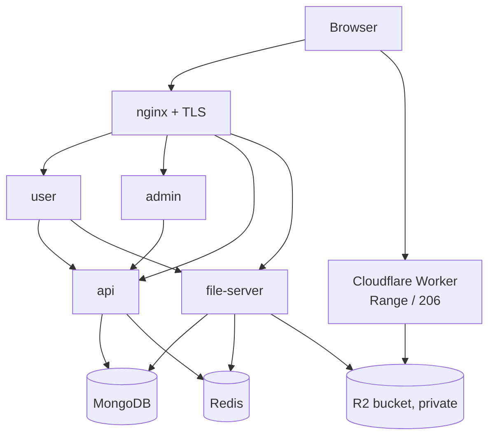
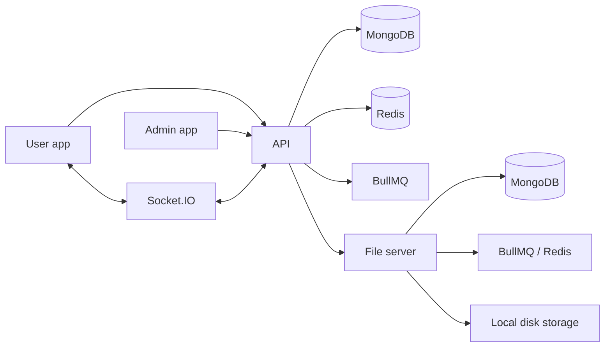

# Architecture

## Applications

| App | Stack | Responsibility | Default local port |
|---|---|---|---|
| `api/` | NestJS 10, MongoDB/Mongoose, Redis, BullMQ, Socket.IO | HTTP API, business logic, auth, feeds, social actions, settings, logs | `8080` |
| `user/` | Next.js 16, React 19, Tailwind CSS 4, React Query, NextAuth | Public feed/profile/post pages and authenticated post/profile workflows | `8081` |
| `admin/` | Next.js 16, React 19, Ant Design 6, React Query, NextAuth | Users, admins, settings, and log viewers | `8082` |
| `file-server/` | NestJS 10, MongoDB/Mongoose, BullMQ, TUS, Sharp, FFmpeg | Upload metadata, disk storage, resumable uploads, image/video processing | `3001` in its app config |

### Shared packages

Two dependency-free packages under `shared/` are consumed by more than one app via `file:` links, so
a rule cannot drift between the client that previews it and the server that enforces it:

| Package | Consumed by | Why it is shared |
|---|---|---|
| `shared/upload-policy` | `api`, `file-server`, `user` | Per-upload-type size, pixel and format limits. The server stays the authority; the client's copy is early feedback. |
| `shared/toast` | `user`, `admin` | One toast container and API, so a bare `react-toastify` call cannot render into a container that does not exist. |

Yarn v1 **copies** `file:` dependencies rather than linking them, so editing a shared package does
not reach a consuming app until that app reinstalls — and in production, until its image is rebuilt.

### Deployment

The repository contains a checked-in deployment stack under `deploy/`: a Docker Compose file for all
six services, a Dockerfile per application, the host nginx vhost configuration, and the Cloudflare
Worker that serves media from R2. See [deployment/README.md](./deployment/README.md) for the
topology and [deployment/routine-deploys.md](./deployment/routine-deploys.md) for the procedure.

## Production topology

All four applications run as containers on a single VM. Host nginx terminates TLS and is the only
public entrypoint; every container binds to loopback, and MongoDB and Redis publish no host port.
Media **reads** bypass the VM entirely — the browser fetches from a Cloudflare Worker with an R2
binding, which is what keeps a small instance viable for video.

Local development runs the same services directly on the host; the ports in the table above are the
local ones.

## Runtime flow

The API requests signed/direct or TUS upload locations from the file server. The file server stores file metadata in MongoDB and currently routes storage operations to `DiskStorageService`; cloud storage fields in configuration are not backed by an S3 implementation.

The API fallback for `FILE_SERVER_BASE_URL` is `http://localhost:8000`, while the file-server app fallback port is `3001`. Local and deployed environments must configure these values consistently instead of relying on both defaults.

## Backend boundaries

- Controllers, gateways, listeners, and jobs are adapters.
- Services own business logic and database orchestration.
- Payload classes validate controller input.
- DTOs define API response shapes.
- Queue listeners maintain post/comment/reaction counters, file references, deleted-author state, and connection cleanup.

## Persistence

The API has collections for users, auth credentials, posts, post media/tag summaries, comments, reactions, settings, and logs. The file server has its own file metadata collection. The API migrations currently seed settings and create/reset the admin account.

## Scheduling and real time

BullMQ schedulers run unused-file cleanup and stale-socket cleanup. Socket.IO uses Redis infrastructure for multi-instance coordination and emits online-status updates. No chat, live-stream, or notification domain exists.
