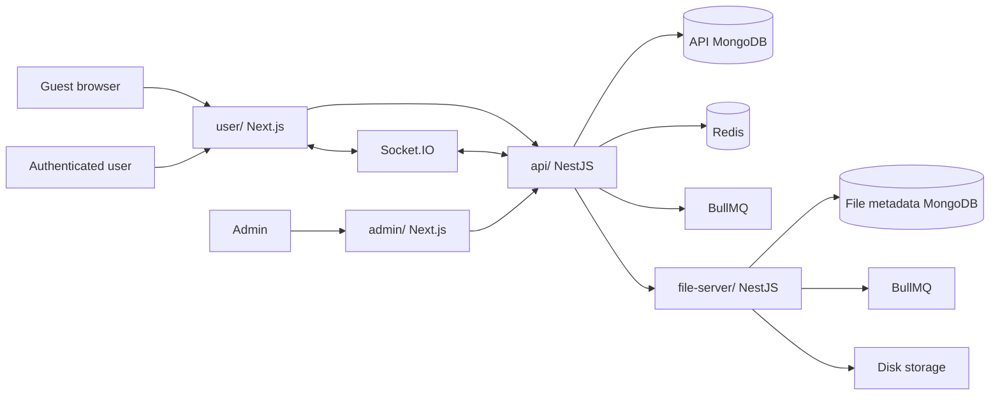

# Relationship Architecture Overview

## Ownership

- `user/` and `admin/` own rendering, session integration, client state, and API clients.
- `api/` owns identity, content, community, system behavior, authorization, and cross-domain orchestration.
- `file-server/` owns upload transport, file metadata, disk I/O, and image/video processing.
- MongoDB stores durable records; Redis/BullMQ supports cache, throttling, events, scheduled cleanup, and presence coordination.

There is no current Docker build/deployment stack. Add one only with complete application Dockerfiles, environment templates, supporting scripts, and validated compose configuration.

See [top-level architecture](../architecture.md) for package versions, ports, and persistence details.
