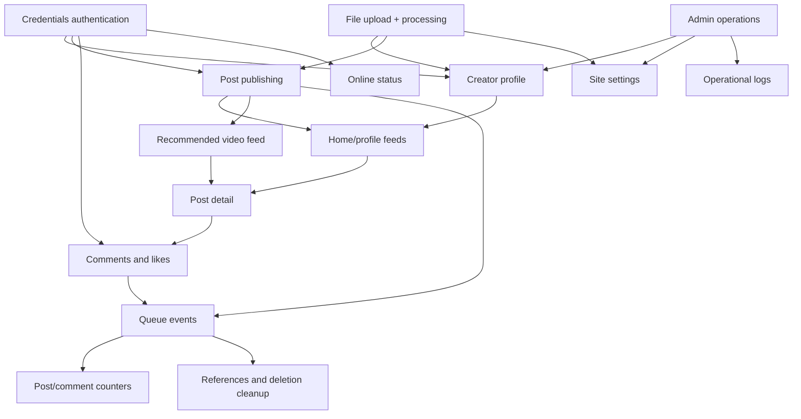

# Feature Relationship Graph

```mermaid
flowchart TD
  Auth["Credentials authentication"] --> Profile["Creator profile"]
  Auth --> Publish["Post publishing"]
  Auth --> Interact["Comments and likes"]
  Auth --> Presence["Online status"]

  Upload["File upload + processing"] --> Profile
  Upload --> Publish
  Upload --> Settings["Site settings"]

  Profile --> Feed["Home/profile feeds"]
  Publish --> Feed
  Publish --> Recommend["Recommended video feed"]
  Feed --> Detail["Post detail"]
  Recommend --> Detail
  Detail --> Interact

  Publish --> Events["Queue events"]
  Interact --> Events
  Events --> Counters["Post/comment counters"]
  Events --> Cleanup["References and deletion cleanup"]

  Admin["Admin operations"] --> Profile
  Admin --> Settings
  Admin --> Logs["Operational logs"]
```

The graph shows runtime dependencies, not a roadmap. Missing product domains are excluded.
