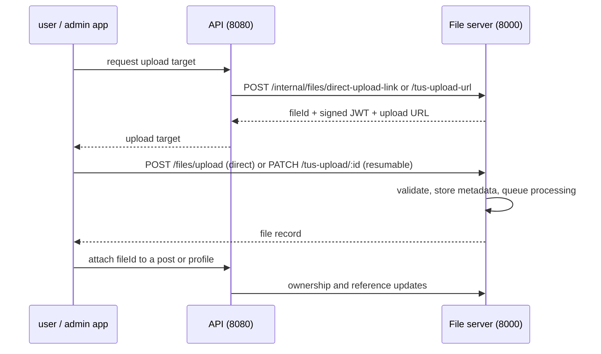

# File Server

Upload and media-processing service for the Douyin Clone platform. It issues signed upload targets,
accepts direct and resumable (TUS) uploads, stores file metadata in MongoDB, processes images with
Sharp and videos with FFmpeg through BullMQ, and serves processed files as static assets.

Built with NestJS 10, MongoDB/Mongoose, Redis + BullMQ, `@tus/server`, Sharp, and FFmpeg.

| Item | Value |
| --- | --- |
| Package | `douyin-clone-file-server` |
| Default port | `8000` via `HTTP_PORT` in `.env.example` (app config falls back to `3001` when unset) |
| API docs | `http://localhost:8000/apidocs` (only when `NODE_ENV=development`) |

> Set `HTTP_PORT` explicitly. The API defaults `FILE_SERVER_BASE_URL` to `http://localhost:8000`,
> while this app's internal fallback port is `3001`; leaving both to defaults breaks uploads.

## How It Fits Together



The browser uploads **directly to this service**; the Next.js apps do not proxy file traffic. The
API only talks to the internal endpoints, authenticated with shared secrets.

## Endpoints

| Surface | Route prefix | Auth | Purpose |
| --- | --- | --- | --- |
| Public upload | `/files` | signed JWT issued by the API | `POST /files/upload` for direct uploads |
| Resumable upload | `/tus-upload` | signed TUS JWT | TUS 1.0 create/patch/head/delete |
| Internal | `/internal/files` | `InternalApiGuard`: `X-API-Key` = `API_SECRET_KEY` **and** `X-Internal-API-Key` = `INTERNAL_API_KEY`. Service credentials only — a bearer JWT is never accepted | upload links, lookup, references, ownership, batch delete, unused-file removal |
| Static files | `/` | public | processed output served from `public/` |

## Capabilities

### Uploads

- Direct multipart upload with a short-lived signed token.
- TUS resumable uploads for large or unstable connections (chunk size and max size configurable).
- Type and size validation per category (image, video, audio, document) before anything is stored.
- Upload errors mark the file record as `error` and clean up the partial TUS artifacts.

### Image processing (Sharp)

- Thumbnail generation with configurable sizes, quality, and Sharp gravity, including the
  `attention` and `entropy` smart crops.
- Presets for avatars (220x220, replaces the original), covers, photo thumbnails, and video posters.
- WebP output and low-quality blur placeholders for progressive loading.
- MD5 hashing of original and processed files.

### Video processing (FFmpeg)

- MP4/H.264 + AAC normalization for browser compatibility.
- Resolution cap (2K by default) and optional multi-resolution output (1080p/720p/480p, disabled by
  default).
- Poster and thumbnail extraction, by default at 10% of duration with a fallback second.
- Optional hardware acceleration with software fallback, plus CPU, memory, and timeout limits.

### Storage

Storage goes through `StorageService`, which currently resolves to `DiskStorageService` only. The
configuration and interfaces leave room for an S3/CDN backend, but **no cloud storage implementation
exists in this repository** — do not document or configure it as if it does.

## Project Structure

```text
src/
├── controllers/
│   ├── file.controller.ts          # public /files upload
│   └── internal/                   # /internal/files, API-to-API only
├── services/
│   ├── file/                       # orchestration, validation, metadata,
│   │                               # processing, image, video, disk storage
│   └── tus/                        # TUS server wiring and upload auth
├── schemas/                        # file metadata
├── dtos/                           # response shapes
├── kernel/                         # queue infrastructure
├── common/                         # constants, interfaces, logging, file helpers
└── config/                         # app, file, image, video, processing, queue, security
```

Runtime directories: `public/` (served output), `temp/` (processing workspace), and
`storage/tus-uploads/` (in-flight resumable uploads). All three are created on boot and checked for
write access.

## Requirements

- Node.js 22+
- Yarn
- FFmpeg and FFprobe 4.x or newer on `PATH` (or set `FFMPEG_PATH` / `FFPROBE_PATH`)
- MongoDB (file metadata and a separate logger database)
- Redis (BullMQ processing queues)

## Setup

```bash
yarn install
cp .env.example .env
```

If `sharp` fails to install for your platform:

```bash
rm -rf node_modules/sharp
yarn add sharp --ignore-engines
```

### Environment

| Variable | Purpose |
| --- | --- |
| `NODE_ENV` | `development` enables Swagger and verbose logging |
| `HTTP_PORT` | HTTP port (use `8000` to match the API default) |
| `HOST` / `BASE_URL` | Host and public base URL used to build file URLs |
| `MONGO_URI` | File metadata database |
| `LOGGER_MONGO_URI` | Log database shared with the API |
| `REDIS_QUEUE_*` | Redis connection for BullMQ |
| `JWT_SECRET` | Signs and validates upload tokens and signed file URLs. Required — there is no fallback, and requests that need it fail without it. Must match the API `FILE_SERVER_JWT_SECRET` |
| `API_SECRET_KEY` | First factor on internal routes, sent as `X-API-Key`; must match the API `FILE_SERVER_API_KEY` |
| `INTERNAL_API_KEY` | Second factor on internal routes, sent as `X-Internal-API-Key`; must match the API `INTERNAL_API_KEY` |
| `CORS_ORIGIN` | Comma-separated allowed origins; unset means `*` |

`main.ts` warns at boot when any of `API_SECRET_KEY`, `INTERNAL_API_KEY`, or `JWT_SECRET` is missing.

`src/common/guards/internal-api.guard.ts` protects `/internal/files/*` and accepts **service
credentials only**: `X-API-Key` (or `Authorization: ApiKey ...`) equal to `API_SECRET_KEY`, plus
`X-Internal-API-Key` equal to `INTERNAL_API_KEY` whenever that value is configured here. Both are
compared in constant time. A bearer JWT is never accepted.

That last point matters and is easy to undo by accident. `JWT_SECRET` signs the short-lived upload
tokens handed to browsers, so any check of the form "is this a valid JWT" would treat every
uploading user's token as an internal credential. Keep client tokens and service credentials on
separate checks; tokens also carry a `purpose` claim (`file-upload`, `tus-upload`, `signed-url`)
that the consuming path verifies.

Optional tuning (all have defaults in `src/config/`):

```bash
FILE_TEMP_DIR=                 # processing workspace
FILE_PUBLIC_DIR=               # served output root
FILE_MAX_SIZE_IMAGE=104857600  # 100MB
FILE_MAX_SIZE_VIDEO=5368709120 # 5GB
TUS_UPLOAD_DIR=
TUS_CHUNK_SIZE=1048576         # 1MB
TUS_MAX_FILE_SIZE=5368709120   # 5GB
SUPPORTED_UPLOAD_METHODS=normal,tus
VIDEO_MAX_WIDTH=2560
VIDEO_MAX_HEIGHT=1440
VIDEO_HWACCEL_ENABLED=true
VIDEO_HWACCEL_PREFER=auto      # auto | nvidia | amd | intel | vaapi | qsv | cpu
FFMPEG_PRESET=fast
FFMPEG_CPU_LIMIT=50
VIDEO_PROCESSING_TIMEOUT=1800
IMAGE_BLUR_ENABLED=true
```

## Running

```bash
yarn start:dev   # watch mode
yarn start       # single run
yarn build       # compile to dist/
yarn lint        # eslint --fix
```

## Testing

This package currently has **no test script and no test suite**. Verify changes with `yarn lint` and
`yarn build`, plus manual upload checks through the `user/` or `admin/` app. Do not claim test
coverage for file-server changes.

## Operations

### TUS temp-file cleanup

`TusServerService` cleans up artifacts when an upload *fails*, but there is no scheduled sweep for
abandoned in-flight uploads. Schedule an OS-level job so `storage/tus-uploads/` and `temp/` cannot
fill the disk:

```bash
# every 2 hours, delete leftovers older than ~12 hours
0 */2 * * * find /path/to/file-server/storage/tus-uploads -type f -mmin +720 -delete >/dev/null 2>&1
0 */2 * * * find /path/to/file-server/temp -type f -mmin +720 -delete >/dev/null 2>&1
```

Monitor with:

```bash
du -sh storage/tus-uploads temp
find storage/tus-uploads -type f | wc -l
```

Unused *stored* files are a separate concern; the API's `cleanup-unused-files` job removes them
through `/internal/files/remove-unused-files`.

### Inspecting failed uploads

```bash
mongosh "$MONGO_URI" --eval "db.files.countDocuments({ status: 'error' })"
```

### Known gaps

- `package.json` declares a `migrate` script, but this package has no `migrate.js` and no
  `migrations/` folder; migrations live in `api/`.
- No S3/CDN storage backend, no health-check controller, and no monitoring module are implemented.

## Further Reading

- [`AGENTS.md`](./AGENTS.md) — working rules for this app
- [`../.agents/skills/file-service-integration/SKILL.md`](../.agents/skills/file-service-integration/SKILL.md) — end-to-end upload workflow and invariants
- [`../docs/domains/file-service.md`](../docs/domains/file-service.md) — domain documentation
- [`../docs/features/file-uploads-and-processing.md`](../docs/features/file-uploads-and-processing.md) — product-level behavior
